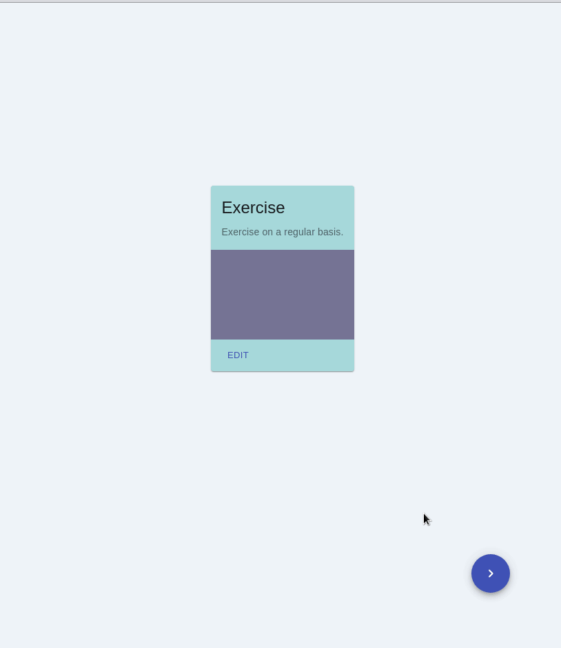

# Project: card-challenge

I found this challenge [here](https://github.com/ronashco/reactjs-card-challenge) and I tried it :relaxed:

## features:
* Shows a random card on the screen when you press the "TRY" button
* Cards shown in different themes (base on their tags)
* Sound Card plays a sound when the card is shown
* Application state and data, fetched from the server, should be managed by Redux
* edit the title and description text on the cards and save it locally

 ### See Demo URL- [Card Challenge](https://nda-kd.github.io/card-challenge/)
 


### Installation
``` 
$ git clone https://github.com/nda-kd/card-challenge.git
```
